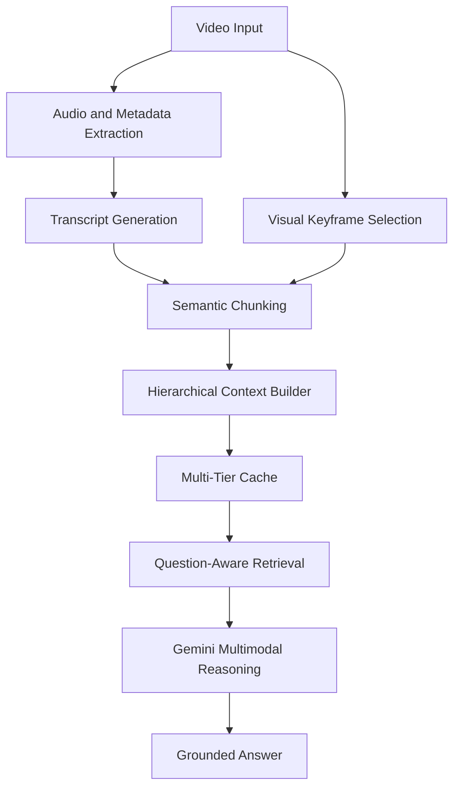

# HALO: Hierarchical Abstraction for Longform Optimization

<div align="center">

  <h3>Open-source infrastructure for efficient long-form video AI</h3>

  <p>
    Ask questions over long videos, lectures, interviews, demos, podcasts, and research talks without paying the full cost of naive frame-by-frame multimodal processing.
  </p>

  <p>
    <b>Started as a Google Summer of Code 2025 project with Google DeepMind. Now maintained as an independent MIT-licensed open-source project.</b>
  </p>

  <br/>

  <a href="https://pypi.org/project/halo-video/">
    
  </a>

  <a href="https://pepy.tech/projects/halo-video">
    
  </a>

  <a href="https://github.com/jeet-dekivadia/google-deepmind/blob/main/LICENSE">
    
  </a>

  <a href="https://www.python.org/">
    
  </a>

  <br/>

  <a href="https://summerofcode.withgoogle.com/">
    
  </a>

  <a href="https://deepmind.google/">
    
  </a>

  <a href="https://github.com/jeet-dekivadia/google-deepmind/issues">
    
  </a>

</div>

<br/>

> HALO is a Python package for long-form video understanding. It combines semantic chunking, transcript-aware retrieval, multimodal analysis, and multi-tier caching to make video question-answering cheaper, faster, and more scalable.

---

## Why HALO exists

Long videos are painful for AI systems.

A naive multimodal video pipeline often does the expensive thing: sample too many frames, repeatedly send similar context to an LLM, lose cross-segment memory, and pay again every time the same video is queried.

HALO takes a different approach.

Instead of treating video as a flat sequence of frames, HALO builds a hierarchy of useful context:

```text
video
  -> audio transcript
  -> semantic segments
  -> visual keyframes
  -> cached context
  -> question-aware retrieval
  -> grounded answer
```

The goal is simple:

> Make long-form video AI usable for students, researchers, developers, educators, and builders who want practical video understanding without burning unnecessary API calls.

---

## Project status

HALO began as my Google Summer of Code 2025 project with Google DeepMind and has now moved into its next phase as a community-facing open-source project.

| Signal             | Status                                                                                                              |
| ------------------ | ------------------------------------------------------------------------------------------------------------------- |
| Package            | [`halo-video`](https://pypi.org/project/halo-video/) on PyPI                                                        |
| Downloads          | [`5.9k+` PyPI downloads](https://pepy.tech/projects/halo-video)                                                     |
| License            | [MIT](LICENSE)                                                                                                      |
| Python             | `>=3.8`                                                                                                             |
| Current release    | `1.0.8`                                                                                                             |
| Maintainer         | [Jeet Dekivadia](https://github.com/jeet-dekivadia)                                                                 |
| Origin             | [Google Summer of Code 2025](https://summerofcode.withgoogle.com/) with [Google DeepMind](https://deepmind.google/) |
| Community interest | 800,000+ project/demo views, 50+ contributor leads, 3 active secondary maintainers                                  |

> Note: HALO is an independent open-source project. It originated through Google Summer of Code with Google DeepMind, but it is not an official Google or Google DeepMind product.

---

## What HALO can do today

* Analyze YouTube videos and local video files
* Extract transcripts and visual context
* Ask questions about video content
* Use Google Gemini for multimodal reasoning
* Cache processed context across sessions
* Reduce redundant API calls through batching and reuse
* Process long-form videos with lower memory pressure
* Provide a CLI-first workflow for fast experimentation
* Serve as a base for video agents, lecture QA, research talk search, demo understanding, and multimodal retrieval systems

---

## Quickstart

### 1. Install

```bash
pip install halo-video
```

### 2. Add your Gemini API key

```bash
export GEMINI_API_KEY="your_api_key_here"
```

For Windows PowerShell:

```powershell
$env:GEMINI_API_KEY="your_api_key_here"
```

Get a Gemini API key here:

```text
https://makersuite.google.com/app/apikey
```

### 3. Run HALO

```bash
halo-video
```

Then paste a YouTube URL or provide a local video path and start asking questions.

---

## Example use cases

### Lecture and classroom video QA

```text
Video: 90-minute machine learning lecture
Question: "What intuition did the professor give for attention mechanisms?"
```

### Research talk understanding

```text
Video: conference talk or seminar
Question: "What are the key limitations the speaker mentions?"
```

### Product demo analysis

```text
Video: product walkthrough
Question: "Which features were shown, and what user problems do they solve?"
```

### Podcast and interview search

```text
Video: long-form interview
Question: "Where do they discuss model evaluation?"
```

### Developer and OSS workflows

```text
Video: technical demo
Question: "Summarize the setup steps and list anything that might break."
```

---

## Core architecture



HALO is built around four core ideas:

| Layer                    | Purpose                                                    |
| ------------------------ | ---------------------------------------------------------- |
| Semantic chunking        | Split long videos around meaning, not arbitrary timestamps |
| Multimodal fusion        | Combine transcript context with visual keyframes           |
| Context caching          | Avoid reprocessing the same video and similar segments     |
| Question-aware retrieval | Retrieve only the most relevant context for each query     |

---

## Repository structure

```text
halo_video/
├── cli.py                       # Interactive command-line interface
├── config_manager.py            # API key and config handling
├── context_cache.py             # Multi-tier caching system
├── gemini_batch_predictor.py    # Gemini API integration and batching
├── transcript_utils.py          # Transcript and video processing utilities
└── __init__.py

tests/
├── test_basic.py                # Core functionality tests
├── test_imports.py              # Import and dependency checks
└── test_vision.py               # Vision/API integration tests

demos/
├── demo.ipynb                   # Interactive notebook demo
├── demo.py                      # Minimal usage demo
└── demo_optimized.py            # Optimized processing demo

docs/
├── GSoC_PROJECT_DOCUMENTATION.md
└── CONTRIBUTING.md
```

---

## What makes HALO different

### 1. Built for long-form video

Most video QA demos work on short clips. HALO was designed around the harder case: lectures, technical walkthroughs, research talks, podcasts, and long YouTube videos.

### 2. Cost-aware by design

HALO is not just a wrapper around a vision model. It tries to avoid waste by reducing redundant processing, caching context, and batching requests intelligently.

### 3. Transcript plus vision, not transcript only

Many video QA systems ignore the visual stream. HALO combines speech, transcript, metadata, and selected visual frames to preserve richer context.

### 4. Open-source and hackable

The project is intentionally modular. You can replace the model provider, improve chunking, add new cache backends, build a web UI, add evals, or extend it into a full video-agent framework.

---

## Development setup

```bash
git clone https://github.com/jeet-dekivadia/google-deepmind.git
cd google-deepmind

python -m venv venv
source venv/bin/activate

pip install -e ".[dev]"
pytest
```

On Windows:

```powershell
git clone https://github.com/jeet-dekivadia/google-deepmind.git
cd google-deepmind

python -m venv venv
venv\Scripts\activate

pip install -e ".[dev]"
pytest
```

Run the CLI locally:

```bash
python -m halo_video.cli
```

---

## Roadmap

HALO is usable today, but it is still early. The next goal is to turn it from a successful GSoC deliverable into a serious open-source video AI toolkit.

### Core engineering

* [ ] Add a cleaner Python SDK interface
* [ ] Add provider adapters for OpenAI, Anthropic, Gemini, and local models
* [ ] Improve long-video regression tests
* [ ] Add reproducible benchmarks for cost, latency, and answer quality
* [ ] Add better cache invalidation and cache inspection tools
* [ ] Add structured output support for summaries, chapters, and citations
* [ ] Add async processing for large batch jobs

### Security and reliability

* [ ] Harden API key handling
* [ ] Audit local file and path handling
* [ ] Add URL validation for remote video sources
* [ ] Add dependency scanning and supply-chain checks
* [ ] Add safer temporary file cleanup
* [ ] Add prompt-injection tests for untrusted transcripts and video content

### Community and usability

* [ ] Improve onboarding docs
* [ ] Add more demos and example notebooks
* [ ] Create `good first issue` tasks
* [ ] Add a simple web UI
* [ ] Add plugin hooks for researchers and developers
* [ ] Publish a full technical architecture guide

---

## Contributing

HALO welcomes contributors.

Good starting points:

* Improve the quickstart and docs
* Add tests for edge cases
* Add examples for different video types
* Improve transcript handling
* Add model-provider adapters
* Build a web UI
* Improve security around file handling, secrets, and untrusted URLs
* Add benchmarks for long-video cost and latency

To contribute:

1. Fork the repository
2. Create a branch
3. Make a focused change
4. Run tests
5. Open a pull request with a clear explanation

```bash
git checkout -b feat/my-improvement
pytest
```

Read the contributing guide:

```text
docs/CONTRIBUTING.md
```

Open issues:

```text
https://github.com/jeet-dekivadia/google-deepmind/issues
```

---

## GSoC 2025 origin

HALO was originally built during Google Summer of Code 2025 with Google DeepMind.

| Field            | Details                                                                                                                   |
| ---------------- | ------------------------------------------------------------------------------------------------------------------------- |
| Program          | [Google Summer of Code 2025](https://summerofcode.withgoogle.com/)                                                        |
| Organization     | [Google DeepMind](https://deepmind.google/)                                                                               |
| Contributor      | [Jeet Dekivadia](https://github.com/jeet-dekivadia)                                                                       |
| Mentor           | Paige Bailey                                                                                                              |
| Timeline         | May 2025 to September 2025                                                                                                |
| Progress tracker | [GSoC Progress Tracker](https://docs.google.com/document/d/1QOIEO70PyZwIOS5W2nZWcum9mdTPrMzWScX19IaovIE/edit?usp=sharing) |
| Final package    | [`halo-video`](https://pypi.org/project/halo-video/)                                                                      |

The original GSoC goal was to explore hierarchical abstraction for efficient long-form video analysis. The project delivered a working Python package, documentation, demos, tests, and a PyPI release.

The next goal is broader: make HALO useful to the open-source community.

---

## Impact

HALO has grown beyond a summer research deliverable.

| Metric               | Current signal                                              |
| -------------------- | ----------------------------------------------------------- |
| PyPI package         | [`halo-video`](https://pypi.org/project/halo-video/)        |
| PyPI downloads       | [`5.9k+`](https://pepy.tech/projects/halo-video)            |
| Project/demo reach   | 800,000+ views across project posts and demos               |
| Contributor interest | 50+ people interested in contributing                       |
| Maintainer group     | 1 primary maintainer, 3 active secondary maintainers        |
| License              | MIT                                                         |
| Focus                | Efficient long-form video QA and multimodal context systems |

---

## Citation

If you use HALO in research, teaching, demos, or derivative open-source work, you can cite it as:

```bibtex
@software{dekivadia2025halo,
  author = {Dekivadia, Jeet},
  title = {HALO: Hierarchical Abstraction for Longform Optimization},
  year = {2025},
  url = {https://github.com/jeet-dekivadia/google-deepmind},
  note = {Google Summer of Code 2025 project with Google DeepMind}
}
```

---

## Links

* PyPI: https://pypi.org/project/halo-video/
* Downloads: https://pepy.tech/projects/halo-video
* Repository: https://github.com/jeet-dekivadia/google-deepmind
* GSoC: https://summerofcode.withgoogle.com/
* Google DeepMind: https://deepmind.google/
* Progress tracker: https://docs.google.com/document/d/1QOIEO70PyZwIOS5W2nZWcum9mdTPrMzWScX19IaovIE/edit?usp=sharing
* Issues: https://github.com/jeet-dekivadia/google-deepmind/issues

---

## Maintainer

Built and maintained by [Jeet Dekivadia](https://github.com/jeet-dekivadia).

<div align="center">

  <a href="https://www.linkedin.com/in/jeetdekivadia/">
    
  </a>

  <a href="https://github.com/jeet-dekivadia">
    
  </a>

  <a href="mailto:jeet.university@gmail.com">
    
  </a>

</div>

<br/>

<div align="center">

<b>HALO started as a GSoC project. The next chapter is open source.</b>

</div>
