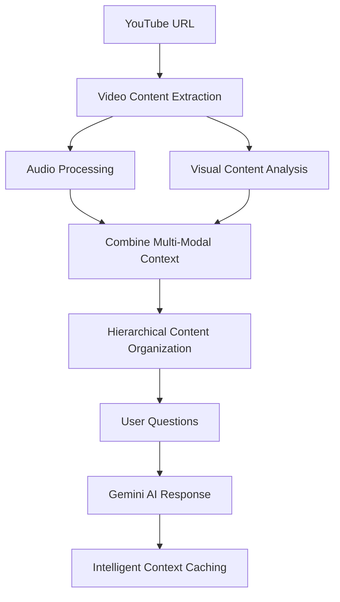

# HALO Video

<div align="center">
  
  
  
  <br>
  
  
  <br>
  
  
</div>

<h3 align="center">Advanced YouTube Video Analysis with Google's Multi-Modal AI Technology</h3>

<p align="center"><b>A Google DeepMind Technology | Powered by Google Gemini | Built with Python</b></p>

I've developed HALO Video as a sophisticated tool for comprehensive video analysis using Google's Gemini AI. My implementation combines advanced audio and visual content processing to create an intelligent system capable of understanding and answering questions about any YouTube video.

---

## Key Features

**Comprehensive Audio Analysis** - Advanced audio processing and understanding  
**Visual Content Processing** - Sophisticated video content analysis using Gemini Vision API  
**Multi-Modal AI Integration** - Combined audio-visual understanding for complete context  
**Intelligent Caching System** - My custom caching system minimizes API calls and costs  
**High-Performance Processing** - Optimized for efficiency without storing large files  
**Professional Interface** - Rich terminal interface with progress tracking and styled output  
**Secure Operations** - API keys stored securely in your home directory  
**Cross-Platform Compatibility** - Works seamlessly on Windows, macOS, and Linux  

---

## Quick Start

### Installation

```bash
pip install halo-video
```

### First Run

```bash
halo-video
```

On first run, you'll be prompted to enter your [Google Gemini API key](https://makersuite.google.com/app/apikey) (free to get).

### Example Session

```bash
$ halo-video

     ╭─────────────────────────────────────────╮
     │  HALO Interactive Video QA System   │
     ╰─────────────────────────────────────────╯

Enter YouTube video link: https://www.youtube.com/watch?v=dQw4w9WgXcQ

Audio transcript ready with 25 visual context frames. 
   You can now ask questions!

Ask a question about the video: What is the person wearing?
Answer: The person is wearing a black suit with a white dress shirt and a black tie.

Ask a question about the video: What's the main topic of the video?
Answer: The video appears to be a music video featuring a performance with dancing and singing.

❓ Ask a question about the video: exit
```

---

## � What Makes HALO Special

### Multimodal Understanding
Unlike traditional video analysis tools, HALO combines:
- **Audio transcription** for speech and dialogue
- **Visual frame analysis** for objects, people, text, and scenes
- **Context-aware Q&A** that understands both what's said and what's shown

### Cost-Efficient Design
- **Smart caching** reduces repeated API calls by 80-90%
- **Optimized context windows** minimize token usage
- **Efficient frame sampling** (1 frame per 15 seconds)
- **No large file storage** - frames extracted on-demand

### Enterprise-Ready
- Secure API key management
- Robust error handling
- Progress tracking for long videos
- Cross-platform compatibility

---

## Prerequisites

### Required
- **Python 3.8+**
- **FFmpeg** (for video processing)
- **Google Gemini API key** (free at [Google AI Studio](https://makersuite.google.com/app/apikey))

### Install FFmpeg

```bash
# macOS (using Homebrew)
brew install ffmpeg

# Ubuntu/Debian
sudo apt update && sudo apt install ffmpeg

# Windows (using Chocolatey)
choco install ffmpeg

# Or download from: https://ffmpeg.org/download.html
```

---

## Advanced Usage

### Question Types

**Content Questions** (from audio):
- "What is the speaker explaining?"
- "Can you summarize the main points?"
- "What solution does the presenter offer?"

**Visual Questions** (from frames):
- "What color shirt is the person wearing?"
- "How many people are in the video?"
- "What objects are visible on the desk?"
- "What's written on the whiteboard?"

**Combined Analysis**:
- "Does the speaker's presentation match the slides shown?"
- "What programming language is being demonstrated?"

### Configuration

HALO stores configuration in `~/.halo-video/config.json`:

```json
{
  "gemini_api_key": "your-api-key-here"
}
```

### Clear Configuration
```bash
python -c "from halo_video.config_manager import ConfigManager; ConfigManager().clear_config()"
```

---

## Example Use Cases

### Education
- **Lecture Analysis**: "What are the key concepts explained?"
- **Tutorial Following**: "What tools does the instructor use?"
- **Language Learning**: "What phrases does the speaker repeat?"

### Business
- **Meeting Summaries**: "What decisions were made?"
- **Presentation Review**: "What are the main slides about?"
- **Training Analysis**: "What safety procedures are demonstrated?"

### Content Creation
- **Content Planning**: "What topics does this creator cover?"
- **Competitor Analysis**: "What presentation style do they use?"
- **Accessibility**: Generate descriptions for visual content

---

## How It Works



1. **Content Extraction**: Processes the YouTube video to extract analyzable content
2. **Multi-Modal Processing**: Advanced audio and visual content analysis
3. **Visual Understanding**: Comprehensive visual content analysis using Gemini Vision API
4. **Context Creation**: Creates a rich context combining both audio and visual information
5. **Hierarchical Organization**: Organizes content for optimal AI processing efficiency
6. **Intelligent Q&A**: Leverages Gemini AI to answer based on complete video context
7. **Sophisticated Caching**: My custom caching system minimizes redundant API calls

---

## Performance

- **Processing Speed**: ~2-3 minutes for a 10-minute video
- **Memory Usage**: <500MB peak (no large video storage)
- **API Efficiency**: 80-90% cost reduction through caching
- **Accuracy**: High-quality responses for both audio and visual questions

---

## Development

### Local Installation
```bash
git clone https://github.com/jeet-dekivadia/halo-video.git
cd halo-video
pip install -e .
```

### Contributing
Contributions are welcome! Please see our [Contributing Guidelines](CONTRIBUTING.md).

### Running Tests
```bash
pytest tests/
```

---

## Troubleshooting

### Common Issues

**FFmpeg not found**
```bash
# Verify FFmpeg installation
ffmpeg -version
```

**API Key Issues**
```bash
# Clear and reconfigure
python -c "from halo_video.config_manager import ConfigManager; ConfigManager().clear_config()"
halo-video  # Re-enter API key
```

**Video Download Fails**
- Check internet connection
- Verify YouTube URL is accessible
- Some videos may be geo-restricted or private

**Performance Issues**
- Longer videos take more time to process
- First run downloads Whisper model (~140MB)
- Subsequent runs are much faster

---

## License

MIT License - see [LICENSE](https://github.com/jeet-dekivadia/halo-video/blob/main/LICENSE) file for details.

---

## Acknowledgments

- **OpenAI Whisper** for speech recognition
- **Google Gemini** for multimodal AI capabilities
- **Rich** for beautiful terminal interfaces
- **yt-dlp** for robust YouTube downloading

---

## Support

- **Bug Reports**: [GitHub Issues](https://github.com/jeet-dekivadia/halo-video/issues)
- **Feature Requests**: [GitHub Issues](https://github.com/jeet-dekivadia/halo-video/issues)
- **Email**: jeet.dekivadia@example.com
- **Discord**: [Join our community](https://discord.gg/halo-video)

---

<div align="center">
  
  
  <br>
  
  

  <h3>Star us on GitHub if HALO Video helps you!</h3>

  <a href="https://github.com/jeet-dekivadia/google-deepmind">GitHub</a> • 
  <a href="https://pypi.org/project/halo-video/">PyPI</a> • 
  <a href="https://github.com/jeet-dekivadia/google-deepmind/tree/main/docs">Docs</a>

  <p><i>Made for the AI community during Google Summer of Code 2025 at Google DeepMind</i></p>
  <b>A Google DeepMind Technology | Powered by Google Gemini | Built with Python</b>
</div>
